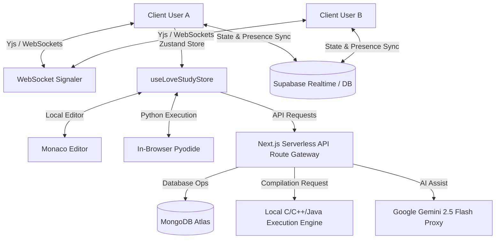

# LoveStudy & LiveCode Notebook: Comprehensive System Architecture & Codebase Guide

This document provides an in-depth walkthrough of the system architecture, file structure, key data flows, state management, and real-time collaboration engines powering the **LiveCode Notebook (LoveStudy)** application.

---

## 🗺️ System Architecture Overview

The application is built on a modern serverless architecture utilizing Next.js, integrating browser-based compilation (via Pyodide) with server-side processing, persistent MongoDB storage, Supabase/WebSocket-based real-time coordination, and Google's Gemini LLM.



---

## 📂 Detailed File Structure & Module Responsibilities

The codebase follows the recommended Next.js App Router structure:

```
├── public/                       # Static public assets, custom badges, and SVG UI assets
├── src/
│   ├── app/                      # Next.js Serverless Endpoints & Dynamic Routing
│   │   ├── api/
│   │   │   ├── cells/            # CRUD endpoints for notebook cell persistence
│   │   │   ├── chat/             # Endpoints for collaborative room chat history
│   │   │   ├── collaboration/    # Endpoints to query online presences & active room metrics
│   │   │   ├── execute/          # Backend code runner for compiler-based languages (C, C++, Java)
│   │   │   ├── gemini/           # Proxy route for secure Gemini API queries
│   │   │   ├── notebooks/        # Endpoints for CRUD operations on entire notebooks
│   │   │   ├── notes/            # Syncing collaborative notebook markdown summary notes
│   │   │   ├── presence/         # User online presence heartbeat sync
│   │   │   └── room-state/       # Overall state aggregation query endpoint
│   │   ├── layout.tsx            # Global layout wrapper
│   │   ├── page.tsx              # Root index page (landing / entrance)
│   │   └── notebook/
│   │       └── [roomId]/         # Dynamic collaborative room container
│   ├── components/               # High-Fidelity UI Presentation Components
│   │   ├── AddNotebookModal.tsx  # Dialog to instantiate new notebooks
│   │   ├── AuthView.tsx          # Username selection & onboarding gateway
│   │   ├── CellsArea.tsx         # Drag-and-drop container for interactive notebook cells
│   │   ├── CodeCell.tsx          # Dynamic-height Monaco code cell with execution controls
│   │   ├── CollaboratorsCard.tsx # Active participants panel
│   │   ├── DashboardView.tsx     # Statistics, study progress, and notebook manager index
│   │   ├── FloatingHearts.tsx    # Aesthetic ambient heart micro-animations
│   │   ├── LiveChat.tsx          # Live messaging element for collaborative study
│   │   ├── LoveStudyWidgets.tsx  # Interactive widget suite (Pomodoro timer & study streaks)
│   │   ├── MarkdownCell.tsx      # Markdown annotation text cells
│   │   ├── NotebookInfo.tsx      # Sidebar notebook metadata list
│   │   ├── RightPanelTabs.tsx    # Sidebar tabs manager (Chat, Notes, AI Helper)
│   │   ├── ScriptEditorView.tsx  # Single-file code editor layout
│   │   ├── Sidebar.tsx           # Left-side navigation bar
│   │   ├── Toolbar.tsx           # Interactive controls (Execution, resetting, export/imports)
│   │   └── TopNav.tsx            # Header showing current room, user, & title editing status
│   ├── hooks/
│   │   └── useRoomSession.ts     # Room lifecycle, DB synchronizer, and active heartbeat hook
│   ├── lib/
│   │   ├── db.ts                 # MongoDB Mongoose configurations and Schema definitions
│   │   ├── pyodide.ts            # Pyodide script loader and configuration helpers
│   │   └── supabase.ts           # Supabase client credentials & real-time client config
│   └── store/
│       └── useLoveStudyStore.ts  # Zustand global store manager (containing all business logic)
```

---

## ⚡ Core Application Workflows & Flows

### 1. Room Session Initialization Flow
When a user clicks a room link (e.g. `/notebook/[roomId]`):

```
[User enters URL]
       │
       ▼
[RoomPage paramsLoaded? (No)] ──► Show loading animation
       │ (Yes)
       ▼
[Check Zustand store user state]
       │
       ├─► Username is missing ──► Show <AuthView />
       │                            [User inputs name] ──► Save to localStorage & store ──► Reload
       │
       └─► Username exists
               │
               ▼
       [Load useRoomSession hook]
               │
               ├─► Connect to Supabase Realtime channel
               ├─► Fetch and seed notebooks from `/api/notebooks`
               ├─► Fetch chat history from `/api/chat`
               ├─► Fetch shared markdown notes from `/api/notes`
               └─► Start Heartbeat Loop (Pushes presence to MongoDB `/api/presence` every 10s)
```

---

### 2. Real-time Code Collaboration Flow (Yjs)
The real-time multiplayer cursor and text editing are powered by Yjs:

```
[Monaco Editor Mounts]
       │
       ▼
[Initialize new Y.Doc() & Y.Text() shared type]
       │
       ▼
[Bind Y-Websocket provider to room WebSocket URL]
       │
       ▼
[Bind Y-Monaco editor adapter]
       │
       ├─► Local Keystrokes ──► Shared Doc Sync ──► Broadcast to all websocket clients
       │
       └─► Remote Keystrokes ◄── WebSocket Recv ◄── Update local Monaco buffer & cursor position
```

---

### 3. Code Execution Flow (Browser Pyodide vs. Backend Compiler)
Code cells are executed either directly in the user's browser or routed through the backend:

```
                  [User clicks Run Cell]
                            │
                            ▼
                  [What is the language?]
                   /                   \
        [python]  /                     \  [java, c, cpp]
                 /                       \
                ▼                         ▼
      [In-browser Pyodide]        [Backend Server Run]
                │                         │
      (Loads Pyodide WASM)        (POST to `/api/execute`)
                │                         │
      (Intercepts stdout/stderr)   (Writes file to workspace)
                │                         │
      (Executes Python code)      (Spawns process: gcc/g++/javac)
                │                         │
      (Returns output object)     (Runs compiled binary locally)
                \                         /
                 \                       /
                  ▼                     ▼
             [Zustand Store receives output]
                            │
                            ▼
             [Updates database & UI console state]
```

---

### 4. Gemini AI Helper Flow
The AI assistant in the right panel is connected via a secure proxy:

```
[User submits message in AI Tab]
       │
       ▼
[Append to local messages array in RightPanelTabs]
       │
       ▼
[Format chat history into Google Gemini API structure]
       │
       ▼
[POST request to `/api/gemini` with payload]
       │
       ▼
[API Route retrieves GEMINI_API_KEY securely from environment]
       │
       ▼
[Queries Google Gemini 2.5 Flash API]
       │
       ▼
[Returns markdown response to client]
       │
       ▼
[Zustand UI renders formatted markdown response]
```

---

### 5. Collaborative Chat & Notes Persistence Flow
Shared chat messages and markdown summary notes are persistent:

*   **Chat Messages**: Posted to `/api/chat`. Stored in MongoDB. Real-time UI updates are triggered via polling/WebSockets.
*   **Shared Notes**: Handled through a debounced persistence loop. When a user edits the markdown notes under the "Notes" tab, the Zustand store registers the keystroke, updates the local visual state instantly, and triggers a debounced `PUT` request to `/api/notes` which saves the raw markdown string in MongoDB.

---

## 🧠 State Management (Zustand)

The state of the entire workspace is managed by `useLoveStudyStore.ts`. It provides:
1.  **View Navigation**: Toggling between `auth`, `notebook`, and `dashboard` screens.
2.  **CRUD Actions**: Add, delete, rename, and re-order notebooks and cells.
3.  **Pomodoro Timer**: Store the running state, time left, and synchronization of the Pomodoro session.
4.  **Streak Tracker**: Increments streaks based on daily active notebook compilations/commits.
5.  **Theme Configuration**: Toggles between light and dark styling instantly across the app.
